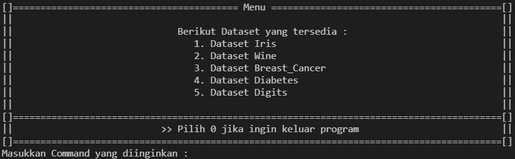
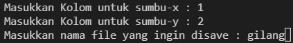
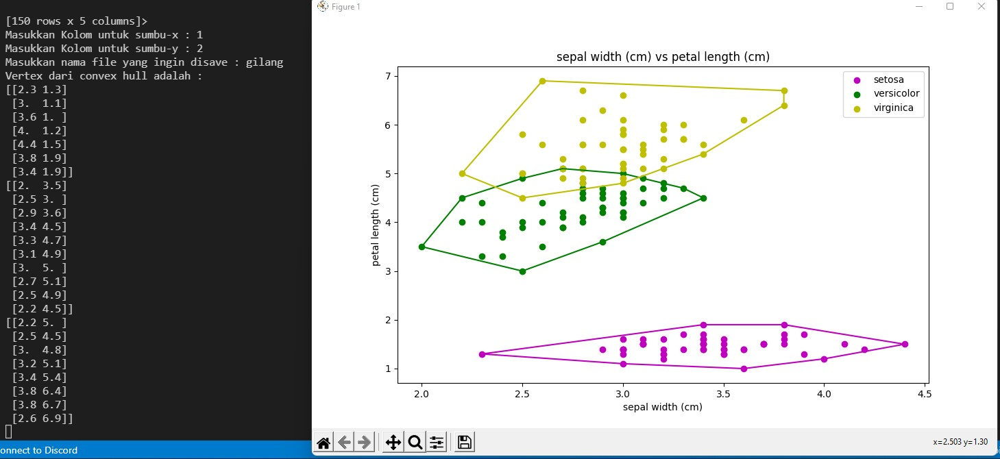
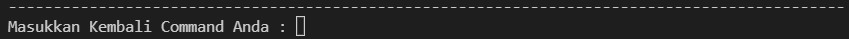
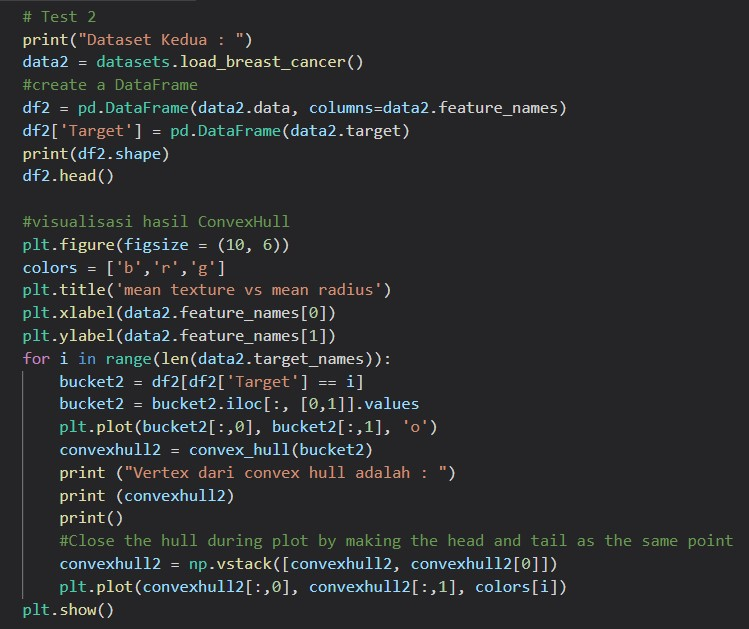
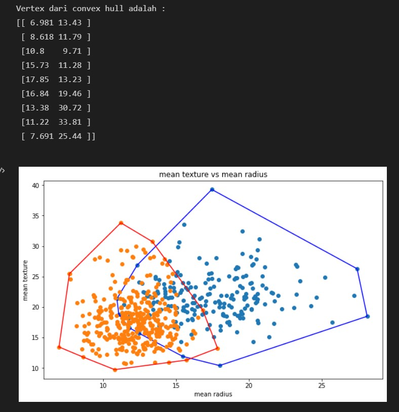
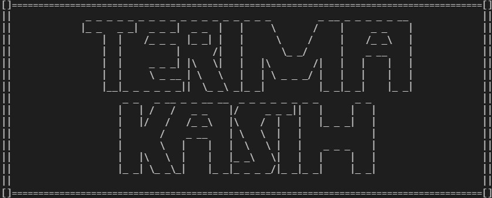

# Tugas Kecil 2: Implementasi Convex Hull untuk Visualisasi Tes Linear Separability Dataset dengan Algoritma Divide and Conquer
### Tugas Kecil 2 IF2211 Strategi Algoritma

## Convex Hull
Convex Hull merupakan permasalahan yang klasik dalam bidang geometri komputasional. Convex Hull sendiri didefinisikan sebagai himpunan titik terkecil yang mengandung set of titik (koordinat) yang sifatnya convex. Suatu set of titik dikatakan convex apabila untuk sembarang 2 buah titik yang berada pada set tersebut, semua segmen garis yang berakhir pada dua titik tersebut terdapat pada set tersebut.

Adapun repository ini berisi implementasi dari library Convex Hull yang dapat digunakan untuk mencari Convex Hull pada suatu set of point.

## Requirement
Berikut adalah requirement yang dipakai untuk mengimplementasikan program ini, pastikan anda telah mendownload dan menginstall semua package berikut.
1. Numpy Versi 1.22.2
2. Pandas Versi 1.4.1
3. Matplotlib Versi 3.5.1
4. scikit-learn Versi 1.0.2

# Cara Penggunaan

## Opening

## Untuk mengimplementasikan programmnya Anda bisa menjalankan file MainProgram.py ataupun main.ipynb
1. Untuk visualisasi di MainProgram.py anda bisa memvisualisasikan 5 dataset, yaitu Iris, Wine, Breast_Cancer, Diabetes, dan Digit. Dimana untuk memvisualisasikannya akan disajikan pilihan menu awal sebagai berikut.

Pada pilihan menu tersebut, user diminta untuk memilih dataset yang ingin divisualisasikan. Setelah itu, pengguna diminta untuk memasukkan kolom sumbu-x dan sumbu-y yang akan diuji serta memasukkan nama file dari hasil visualisasi plot yang akan diuji (cukup berikan namanya saja tanpa ekstensi apapun seperti .png, .txt, dll. Karena akan otomatis tersimpan dengan format PNG), sebagaimana gambar dibawah ini.

Setelah langkah tadi, maka di terminal akan disajikan vertex dari convex hull yang dihasilkan serta akan muncul hasil plot dari convex hull di luar terminal, seperti gambar di bawah ini.

Setelah itu, anda diminta memasukkan command yang sama dengan command pada menu memilih dataset dan mengulangi langkah-langkah sebelumnya atau mengakhiri program dengan memasukkan command 0, seperti gambar di bawah ini.
 
 

2. Untuk memvisualisasikan di file main.ipynb, pastikan anda sudah menginstall ipynb (jupyter notebook). Untuk visualisasinya anda, dapat menggunakan IDE jupiter_notebook ataupun Visual Studio Code. Untuk memvisualisasikannya di file main.ipynb, telah tersedia source code masing-masing test dataset pada file tersebut. Jadi, Anda tinggal memilih untuk mengerun source code mana yang anda ingin visualisasikan. Seperti gambar yang ditunjukkan di bawah ini.

## Penutup

## Identitas Author
Nama  : Muhammad Gilang Ramadhan (13520137).//
Email : gilanglahat22@gmail.com.

## Copyright By Muhammad Gilang Ramadhan
